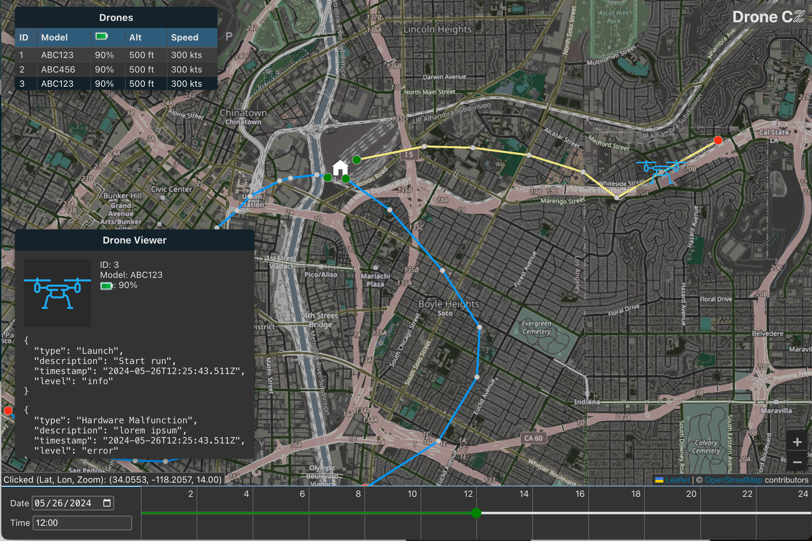

# Drone C2

Drone Flight Tracker is an application designed to track and visualize drone flight
data stored in a PostgreSQL database. The frontend, developed with React and Leaflet
in TypeScript, provides an interactive and intuitive user interface for viewing flight
paths and details. The backend, built using Go (Golang), efficiently handles data
processing and API interactions. The application supports flexible deployment with
optional Docker support, allowing it to run seamlessly both in containerized
environments and locally. The data contained in the database is generated from
scripts or hand crafted for the easier items.



## Production

Run: `docker-compose up --build`
View Frontend: http://localhost:3000/
Exercise Backend: http://localhost:8080/
Access DB: `psql -h localhost -p 5432 -U postgres -d drone-c2 -W` - it will prompt for a password
Stop and remove containers + volumes: `docker compose down -v`

## Development

```sh
npm start  # Runs the app in the development mode.
npm test  # Launches the test runner in the interactive watch mode.
npm run build  # Builds the app for production to the `build` folder.
npm run format  # Ensure code quality.
```

## Backend Lint

go install github.com/golangci/golangci-lint/cmd/golangci-lint@latest
golangci-lint run
go install github.com/segmentio/golines@latest
golines -m 100 -w .
